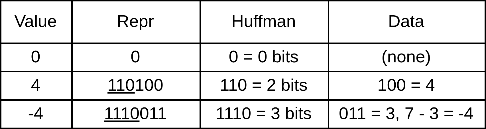

# **Implementing a JPEG Decoder**

## Theia Vogel (https://vgel.me)
### (they/she)

<!--
Hi, I'm Theia. Let's talk about JPEG.
-->

---

# Everyone loves JPEG!


<!--
JPEG is a ubiquitous image format, and for that attracts a lot of criticism. Much shade has been thrown at JPEG for its weaknesses: compression artifacts, lack of transparency, successive layers of compression destroying an underlying image...

But despite all that, JPEG survives. Why?
-->

---


# It has advantages, though

```
$ du -h iceberg*
2.7M	iceberg.bmp
664K	iceberg.png
104K	iceberg.jpg
```

<!--
JPEG is a format optimized for human perception. That means, unlike PNG, JPEG isn't (usually) lossless: it's willing to throw away detail it thinks you won't see.

While that algorithm sometimes breaks down -- most notably with text, which we'll talk about later -- when it works, it produces nearly flawless images at a fraction of the size of other image formats.

The core of the JPEG algorithm is also at work in video codecs too, where size is even more important. So if you're interested in the inner workings of, say, H264 or VP9, then JPEG is a great way to introduce yourself to the basic concepts in a simpler environment.
-->

---

# How does JPEG actually work, though?

<!--
So what are those basic concepts? How does this image format actually work?

Let's explore JPEG by writing a dead-simple decoder. We're not going to try and support every JPEG on the internet, or be fast, or be particularly correct.
-->

---

```
$ stat -c '%s bytes' subject.jpg
5378 bytes

$ xxd subject.jpg | head -n 5
00000000: ffd8 ffe0 0010 4a46 4946 0001 0101 012c  ......JFIF.....,
00000010: 012c 0000 fffe 0013 4372 6561 7465 6420  .,......Created
00000020: 7769 7468 2047 494d 50ff db00 4300 2016  with GIMP...C. .
00000030: 181c 1814 201c 1a1c 2422 2026 3050 3430  .... ...$" &0P40
00000040: 2c2c 3062 464a 3a50 7466 7a78 7266 706e  ,,0bFJ:Ptfzxrfpn
```

<!--
We're going to focus on this image, which uses a very simple subset of the JPEG format. By the end, we'll be able to decode it and see what it actually is!
-->

---

# Layer 1: Segments

<!--
So we have a bit over 5300 bytes to deal with here. How do we make sense of this byte soup?

The first layer of structure in a JPEG file is the segment sequence.
-->

---


<!--
A segment is, well, a segment of the file that's prefixed with a 0xFF byte. It's followed by another byte that represents what kind of segment it is -- for example, a start of image segment or comment segment.

Depending on the kind of segment, there may be additional data, in which case the kind byte is followed by a 2-byte length, and then that many bytes of data.

-->

---


<!--
The first 4 bytes of our file, 0xFF 0xD8, are actually the entirety of the first segment. 0xD8 is the kind byte for "Start of Image", a segment with no data that represents the start of
the file.

When `stat` or a file manager auto-detects a JPEG file, they look for the magic number
ff d8 ff -- the start of image segment, plus the marker byte of the next segment.
-->

---


<!--
Here's a segment with some more data, a comment segment. This was inserted by my image editing program, GIMP. It holds arbitrary ASCII text, uncompressed since it's expected to be short.
-->

---


<!--
Finally, here's the weird one, Start of Scan. This segment holds compressed data, so the length field is only the uncompressed header prefix. We'll need to scan through the data following this segment looking for 0xFF bytes. If a 0xFF byte is followed by a 0x00 byte, it's an escaped 0xFF byte and that pair should be interpreted as a single 0xFF. Otherwise, it's the start of a new segment.
-->

---

```python
@dataclass
class Segment:
    # these aren't all the kinds, just the ones we care about
    KINDS = {
        0xC0: "StartOfFrameBaseline",
        0xC4: "DefineHuffmanTable",
        0xD8: "StartOfImage",
        0xD9: "EndOfImage",
        0xDA: "StartOfScan",
        0xDB: "DefineQuantTable",
        0xE0: "AppSpecific",
        0xFE: "Comment",
    }
    OTHER = "Other" # unknown kind byte

    kind: str
    length: int
    data: bytes

    def __repr__(self) -> str:
        if len(self.data) <= 20:
            data = repr(self.data)
        else:
            data = repr(self.data[:17]) + "..."
        return f"Segment(kind={self.kind!r}, length={self.length}, data={data})"
```

<!--
Now we know enough about segments to define a data type for them, We'll map the kind byte to an easier-to-grok str...
-->

---

```python
def read_segment(data: bytes) -> tuple[Segment, bytes]:
    """Reads a segment, returning it and any bytes that follow it"""

    marker_byte, kind_byte = data[0], data[1]
    assert marker_byte == 0xFF
    has_no_data = kind_byte in range(0xD0, 0xD9 + 1)
    kind = Segment.KINDS.get(kind_byte, Segment.OTHER)

    if has_no_data:
        remainder = data[2:]
        return Segment(kind, length=0, data=bytes()), remainder
    else:
        length = (data[2] << 8) + data[3] - 2
        payload = data[4 : 4 + length]
        remainder = data[4 + length :]

        if kind == "StartOfScan":
            # read through huffman data for next segment
            while len(remainder):
                if remainder[:2] == bytes([0xFF, 0x00]): # escape sequence
                    payload += bytes([0xFF])
                    remainder = remainder[2:]
                elif remainder[0] == 0xFF: # a new segment header!
                    break
                else: # a regular byte
                    payload += remainder[:1]
                    remainder = remainder[1:]

        return Segment(kind, length, payload), remainder
```

<!--
Now we can write a function that parses a single segment from the file.

(Don't worry about following all the code right now -- slides will be available online)
-->

---

```python
def read_all_segments(data: bytes) -> dict[str, list[Segment]]:
    result: dict[str, list[Segment]] = {}

    while len(data):
        segment, data = read_segment(data)

        if segment.kind not in result:
            result[segment.kind] = [segment]
        else:
            result[segment.kind].append(segment)

    return result


image_segments = read_all_segments(image_data)
```

<!--
And finally, we can call that function repeatedly in a loop, reading all the segments and putting them into a dictionary based on their kind str.
-->

---

```python
{'StartOfImage':         [Segment(kind='StartOfImage', length=0, data=b'')],
 'AppSpecific':          [Segment(kind='AppSpecific', length=14, data=...)],
 'Comment':              [Segment(kind='Comment', length=17, data=b'Created wi...')],
 'DefineQuantTable':     [Segment(kind='DefineQuantTable', length=65, data=...),
                          Segment(kind='DefineQuantTable', length=65, data=...)],
 'StartOfFrameBaseline': [Segment(kind='StartOfFrameBaseline', length=15, data=...)],
 'DefineHuffmanTable':   [Segment(kind='DefineHuffmanTable', length=23, data=...),
                          Segment(kind='DefineHuffmanTable', length=38, data=...),
                          Segment(kind='DefineHuffmanTable', length=21, data=...),
                          Segment(kind='DefineHuffmanTable', length=21, data=...)],
 'StartOfScan':          [Segment(kind='StartOfScan', length=10, data=...)],
 'EndOfImage':           [Segment(kind='EndOfImage', length=0, data=b'')]}
```

<!--
Now that we've parsed the image, we can see the structure more clearly.

We have a Start Of Image segment, an app-specific JFIF segment we can ignore, the "Created with GIMP" comment, two quantization table definitions we'll cover later with the Discrete Cosine Transform, a Start of Frame segment that holds the image metadata like width and height, four Huffman table definitions we'll use to decompress the image data in a moment, the image data in the Start of Scan segment, and finally the End of Image segment.
-->

---

# Layer 2: Huffman Tables and Run-Length Encoding

<!--
JPEGs store the compressed image data in a series of 8x8 sub-blocks.
Each sub-block has several layers of lossless compression on top of the lossy perceptual compression.

Let's quickly go through these lossless compression techniques, starting with Huffman coding.
-->

---


<!--
The basic idea behind Huffman coding is that, in a sequence of data, some sub-sequences are more common than others. It's worth using more bits to represent uncommon sequences, if we get to use less bits to represent common sequences.

In the Huffman table above, we need to represent 6 distinct values. The naive approach would use 3 bits per value: 0 is 000, 1 is 001, 2 is 010, etc. However, since 0 is much more common in a JPEG sub-block than 5, it makes sense to sacrifice 5 -- representing it with 6 bits instead of 3 -- so we can represent 0 with only a single bit.

Notice that none of these sequences are prefixes of each other -- you can always read a Huffman-encoded bitstream bit-by-bit, and once the sequence you've buffered matches one in the table, you can immediately emit a value. The JPEG encoder takes care of defining the table like this for us.
-->

---

```python
@dataclass(eq=True, frozen=True)
class HuffmanTableId:
    kind: str
    id: int

@dataclass
class HuffmanTable:
    id: HuffmanTableId
    code_to_value: dict[int, int]

    def __contains__(self, key) -> bool:
        return key in self.code_to_value

    def __getitem__(self, key) -> int:
        return self.code_to_value[key]
```

<!--
So to implement this, we first can whip up a basic datatype for the Huffman tables. There are multiple tables embedded in a JPEG image that are specialized to different types of values and components. The `kind` of a table is either AC or DC. This will switch automatically within a sub-block -- DC is used for the first value, and AC for the rest, the reason for this will make more sense later.

The ID can be specifically requested by a certain component. Generally, the luminance (lightness) component will use one table, and the chrominance (color) components will use a different one, giving 4 total tables in the image file -- AC and DC x 2 ids.
-->

---

```python
def read_huffman_table(data: bytes) -> HuffmanTable:
    kind = "dc" if data[0] & 0xF0 == 0 else "ac"
    id = data[0] & 0x0F

    codes_per_code_length = data[1:17]
    values = list(data[17:])

    code = 0
    code_to_value: dict[int, int] = {}
    for code_len in range(1, 17):
        for _ in range(codes_per_code_length[code_len - 1]):
            code_to_value[code] = values[len(code_to_value)]
            code += 1
        code *= 2  # add zero to the end of code

    return HuffmanTable(HuffmanTableId(kind, id), code_to_value)


image_huffman_tables: dict[HuffmanTableId, HuffmanTable] = {}
for ht_segment in image_segments["DefineHuffmanTable"]:
    ht = read_huffman_table(ht_segment.data)
    image_huffman_tables[ht.id] = ht
```

<!-- To parse these tables from a DefineHuffmanTable segment, we first, parse the id -- upper 4 bits are kind, lower 4 are id number.

Then, the codes are defined as simply a count of codes for each code length between 1 and 16 inclusive. Any data bytes after the 16 bytes of code lengths are the values for those codes.

To calculate the codes from the lengths, we increment a working code for each of the N codes for a given length. That generated code is assigned to the next available value in the values list. When we've generated all codes of a certain length, we add a 0 onto the end of the code by multiplying by two, and continue incrementing the code. We don't do any validation to make sure, for example, that codes don't overflow their length, instead assuming the best of the encoder :)
-->

---

```python
@dataclass
class Bitstream:
    cursor: int
    bits: list[int]

    ...

    def read_unsigned(self, count: int) -> int:
        i = 0
        for bit in self.read(count):
            i = (i << 1) + bit
        return i

    def read_huffman(self, table: HuffmanTable) -> int:
        for code_len in range(1, 17):
            code = self.read_unsigned(code_len)
            if code in table:
                return table[code]
            else:
                self.cursor -= code_len  # reset for next iteration

        raise RuntimeError("unterminated huffman sequence")

    ...
```

<!--
To read values out of the compressed bitstream, we have a `Bitstream` type that represents bits inefficiently as a list of integers. It will incrementally read longer and longer codes from the bitstream, trying to look them up in the Huffman table, putting the bits back and retrying with a longer code if they don't match.
-->

---



<!--
The next layer of lossless compression on top of the Huffman coding is a length-prefixed integer encoding.
All integers in a JPEG data block aren't represented with Huffman codes, this would bloat the Huffman tables unreasonably.

Rather, the bit length of the integer is Huffman-encoded, and prefixed to that many bits. Furthermore, there's a signed offset: if the first bit is 1, the integer is interpreted as positive, otherwise it's offset by -(2**bit_len - 1) to get a negative integer.
-->

---

```python
@dataclass
class Bitstream:
    ...

    def read_unsigned(self, count: int) -> int:
        i = 0
        for bit in self.read(count):
            i = (i << 1) + bit
        return i

    def read_signed(self, count: int) -> int:
        if count == 0:
            return 0
        elif self.bits[self.cursor] == 1:  # positive
            return self.read_unsigned(count)
        else:  # negative offset
            return self.read_unsigned(count) - (2 ** count - 1)

    ...
```

<!-- The code for this also lives in the Bitstream type. However, there's no method to read the Huffman length prefix and automatically read a trailing signed value, since sometimes other information is packed into the upper bits of the length prefix. We'll handle that along with the run-length encoding. -->

---

```python
def read_subblock(
    bits: Bitstream,
    component: ComponentMetadata,
    prev_dc: int,
) -> tuple[int, np.ndarray]:
    sub_block = np.zeros(64)

    # read the dc offset, if any
    n_dc_bits = bits.read_huffman(component.huffman_dc_table)
    dc = prev_dc + bits.read_signed(n_dc_bits)
    sub_block[0] = dc

    ac_idx = 1  # dc is 0
    while ac_idx < 64:
        header = bits.read_huffman(component.huffman_ac_table)
        if header == 0:
            break  # marker to skip rest of block

        n_leading_zeros = (header & 0xF0) >> 4
        ac_idx += n_leading_zeros
        sub_block[ac_idx] = bits.read_signed(header & 0x0F)
        ac_idx += 1

    return (dc, sub_block.reshape((8, 8)))
```

<!--
Now we can write a function to read a single image sub-block. A sub-block represents an 8x8 grid of pixels for a single color component.

The first element of a sub-block, the "DC", is special. It's encoded as an offset from this component's previous sub-block's DC. So we return the DC along with the block as a whole to make that easier.
The DC offset is encoded as a Huffman-encoded number of bits, and then that many bits are interpreted as a signed number like we described before.

The other 63 values are AC values. They're also encoded as a Huffman-encoded number of bits and then a signed number. However, the upper 4 bits of that Huffman value are special. They denote a number of zero values to skip before writing the AC value. The idea is, JPEG sub-blocks can have lots of zeros because of something called quantization, which we'll talk about in a moment. So an AC value can be prefixed with up to 15 zeros just by setting the upper 4 bits of the Huffman-encoded value.

Also, if the Huffman-encoded value is 0, that means the entire rest of the block is zeroes, so we exit early in that case. 
-->

---

```python
def read_subblocks(
    data: bytes,
    image: ImageMetadata,
) -> list[tuple[np.ndarray, np.ndarray, np.ndarray]]:
    bits = Bitstream.from_bytes(data)

    prev_luma_dc, prev_chcb_dc, prev_chcr_dc = 0, 0, 0
    blocks: list[tuple[np.ndarray, np.ndarray, np.ndarray]] = []

    while len(bits) >= 8:  # ignore any padding bits at end
        # order of components is 1-3-2
        prev_luma_dc, luma = read_subblock(bits, image.components[1], prev_luma_dc)
        prev_chcb_dc, chcb = read_subblock(bits, image.components[3], prev_chcb_dc)
        prev_chcr_dc, chcr = read_subblock(bits, image.components[2], prev_chcr_dc)
        blocks.append((luma, chcr, chcb))

    return blocks


image_start_of_scan_segment = image_segments["StartOfScan"][0]
subblock_data = image_start_of_scan_segment.data[image_start_of_scan_segment.length :]
blocks = read_subblocks(subblock_data, image_metadata)
```

<!--
To read all the sub-blocks, we just keep reading them in order from the bitstream until its exhausted.

For some reason, the blocks are written into the bitstream out of their component order -- it goes 1-3-2 -- I'm not sure why. That lost me some debugging time :-)
-->

---

```
>>> blocks[2][0]
array([[ 5.,  2.,  3., -2., -3., -1.,  0.,  0.],
       [ 2.,  1., -1., -1.,  0.,  0.,  0.,  0.],
       [ 0.,  0.,  0.,  0.,  0.,  0.,  0.,  0.],
       [ 0.,  0.,  0.,  0.,  0.,  0.,  0.,  0.],
       [ 0.,  0.,  0.,  0.,  0.,  0.,  0.,  0.],
       [ 0.,  0.,  0.,  0.,  0.,  0.,  0.,  0.],
       [ 0.,  0.,  0.,  0.,  0.,  0.,  0.,  0.],
       [ 0.,  0.,  0.,  0.,  0.,  0.,  0.,  0.]])
```

<!--
So now we have our sub-blocks, but they don't really look like image data... they're filled with zeroes, mostly at the end. What's going on?
-->

---

# Layer 3: The Discrete Cosine Transform

<!-- It's time to talk about JPEG's lossy compression technique, the Discrete Cosine Transform, or DCT. -->

---


<!--
The discrete cosine transform is a way of representing an image in terms of a set of basis functions based off of cosine. If you're familiar with the Fourier transform, this is a similar idea -- it's called a Fourier-related transform.

This image represents the 64 basis functions used for an 8x8 JPEG sub-block. They start out in the upper left as very low-frequency and low-detail, and increase in frequency and detail as you head towards the bottom right.

An image represented via a DCT is simply an 8x8 matrix of coeffecients that represent how strong each of the basis functions are in the image. Let's see what that looks like.

-->

---


<!--
Here's an example I put together of incrementally adding basis functions to construct an image. On the left is the basis function most recently added, and the right is the accumulated image. Notice how it starts out as a formless blob, and by the end, once all 64 basis functions have been accumulated into the image, it's a lossless, 1:1 copy of the original.

You might be wondering what the point of this is -- we've taken 64 bytes of image data and turned it into 64 bytes of DCT coefficients. Why bother?
-->

---


<!--
The reason is *Quantization*. This is where JPEG's optimization for human perception comes in. Humans are, generally speaking, bad at seeing high-frequency data. Looking a photo of a person, we can't really tell without squinting whether each hair on their head is in the image, or if their hair is a general blur of hair-color. JPEG takes advantage of this.

In the image above, I've extremely skillfully drawn a zig-zag on top of the DCT basis functions. It starts in the upper-left, at the lowest-frequency basis function, and snakes over to the bottom right.

When an image is encoded, a quantization table is used to divide each coefficient. Since the coefficients are represented as integers, if a coefficient is smaller than the quantization factor, it will become a zero. The sub-block is then rearranged according to this zig-zag pattern -- for example:
-->

---


<!--
, this coefficient is the third value in the encoded sub-block, not the 9th.

Since the quantization factors are higher for higher-frequency basis functions, and the zig-zag pattern rearranges those high-frequency basis functions at the end of the sub-block, this leads to sub-blocks with a lot of trailing zeroes -- perfect for the run-length encoding we talked about earlier.
-->

---

```python
UNZIGZAG = [
     0,  1,  5,  6, 14, 15, 27, 28,
     2,  4,  7, 13, 16, 26, 29, 42,
     3,  8, 12, 17, 25, 30, 41, 43,
     9, 11, 18, 24, 31, 40, 44, 53,
    10, 19, 23, 32, 39, 45, 52, 54,
    20, 22, 33, 38, 46, 51, 55, 60,
    21, 34, 37, 47, 50, 56, 59, 61,
    35, 36, 48, 49, 57, 58, 62, 63
]
```

<!-- So let's implement this. First, we define the zigzag indices... -->

---

```python
def dequantize_subblock(
    subblock: np.ndarray, component: ComponentMetadata
) -> np.ndarray:
    unzig = subblock.flatten()[UNZIGZAG]
    dequant = unzig * component.quantization_table.values
    return dequant.reshape((8, 8))


def dequantize_subblocks(
    subblocks: list[tuple[np.ndarray, np.ndarray, np.ndarray]], image: ImageMetadata
) -> list[tuple[np.ndarray, np.ndarray, np.ndarray]]:
    return [
        (
            dequantize_subblock(luma, image.components[1]),
            dequantize_subblock(chcr, image.components[2]),
            dequantize_subblock(chcb, image.components[3]),
        )
        for (luma, chcr, chcb) in subblocks
    ]


dequantized_blocks = dequantize_subblocks(blocks, image_metadata)
```

<!-- And then we can unzigzag our sub-blocks with numpy's indexing magic, and de-quantize them with an element-wise multiplication with the quantization table for this component. -->

---

```python
def f_dct(row: int, col: int) -> float:
    norm = 1 / math.sqrt(2) if row == 0 else 1
    cos = math.cos((2 * col + 1) * row * math.pi / 16)
    return norm * cos / 2


DCT = np.array([[f_dct(row, col) for col in range(8)] for row in range(8)])


def idct_subblock(subblock: np.ndarray) -> np.ndarray:
    return ((DCT.T @ subblock.T @ DCT) + 128).round().clip(0, 255).astype(int)
```

<!-- Now we can inverse-DCT the de-quantized subblocks. We define the DCT matrix -- I won't go over the math here, but it's basically just a bunch of cosine functions -- and we dot the sub-block with the DCT transpose and the DCT, and offset it from -128 through 128 to 0 through 255. The quantization process can lead to values out of the expected range, so we clip them, as well. -->

---

# Color Spaces: Y CrCb?

<!--
Finally, we need to convert from JPEG color space to RGB. JPEG uses YCrCb, which is luminance, Y, red, Cr, and blue, Cb -- green is inferred from the other components.
-->

---

```python
rgb_blocks: list[tuple[np.ndarray, np.ndarray, np.ndarray]] = []
for luma, chcr, chcb in dequantized_blocks:
    y = idct_subblock(luma)
    cr = idct_subblock(chcr)
    cb = idct_subblock(chcb)

    r = y + 1.402 * (cr - 128)
    g = y - 0.34414 * (cb - 128) - 0.71414 * (cr - 128)
    b = y + 1.772 * (cb - 128)

    r = r.clip(0, 255).astype(int)
    g = g.clip(0, 255).astype(int)
    b = b.clip(0, 255).astype(int)

    rgb_blocks.append((r, g, b))
```

<!--
Converting uses some magic constants.

Offscreen I wrote some code to combine these RGB blocks into a PIL image, but that's not very interesting so I won't show it here.

Finally, we can `image.show()` our image!
-->

---


<!--  -->

<!--
Thanks for listening to my talk! The code will be available on Github if you'd like to peruse it at a slower pace.
-->